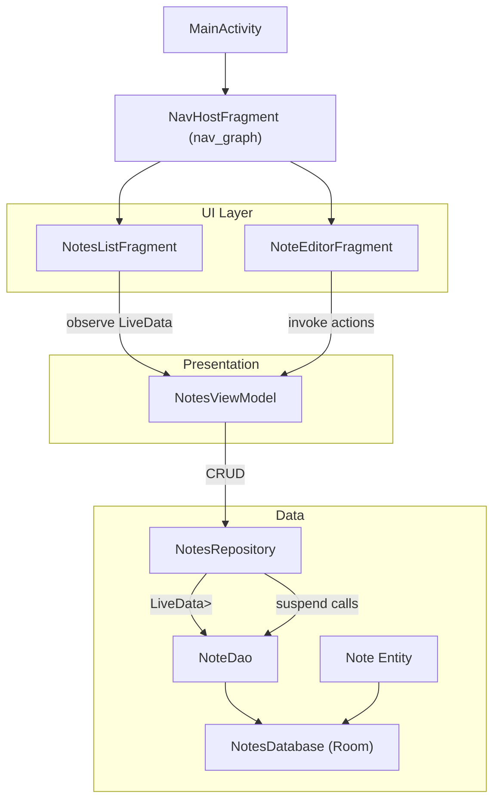
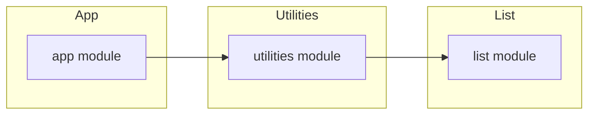

# Personal Notes Android App — High-Level Architecture

## Overview
The application is a single-activity Android app using Fragments for navigation between the notes list and the note editor. It adopts the Android Architecture Components stack: ViewModel, LiveData, Room, and Navigation. UI is built with ViewBinding and Material components. Data persistence is local-only via Room.

## System Components
- MainActivity: Hosts NavHostFragment and applies the app theme and window configuration.
- NotesListFragment: Displays the list of notes, provides search, delete with undo, and navigation to the editor.
- NoteEditorFragment: Creates or edits a note with inline validation.
- NotesViewModel: Exposes observable notes list and one-shot snackbar messages; performs CRUD via repository.
- NotesRepository: Mediates between ViewModel and Room DAO.
- Room stack: Note entity, NoteDao, NotesDatabase singleton.
- Navigation: nav_graph.xml defines routes and transitions.
- Theming: Material3 DayNight theme with monochrome color roles, light/dark palettes.

## Module/Component Diagram

## Data Model
- Note (Room entity)
  - id: Long (Primary Key, autoGenerate = true)
  - title: String
  - content: String
  - updatedAt: Long (epoch millis; used for sorting)
- DAO queries:
  - getAll(): LiveData<List<Note>> ordered by updatedAt DESC
  - getById(id): Note?
  - insert(note): Long (REPLACE on conflict)
  - update(note)
  - delete(note)
- Database:
  - NotesDatabase (version 1), destructive migrations enabled in this prototype.
- Repository:
  - Provides LiveData stream from getAll(), and suspend CRUD functions.

## State Management
- NotesViewModel holds:
  - notes: LiveData<List<Note>> from repository.
  - snackbar: LiveData<String?> for transient messages after operations.
- Editor state (title/content) is managed within NoteEditorFragment via ViewBinding fields and loaded note when editing.
- Background operations use viewModelScope with coroutines; IO work is dispatched off the main thread.

## Navigation Flow
- Start destination: NotesListFragment.
- Actions:
  - notesList -> noteEditor (action_notesList_to_editor), with optional argument noteId (Long, default -1).
  - Editor pops back to list after save.
- Transitions:
  - Custom slide animations for forward/back navigation defined in res/anim.

## UI Architecture and ViewBinding
- Single Activity (ComponentActivity) sets content view to activity_main with a NavHostFragment.
- Each Fragment inflates its corresponding ViewBinding:
  - FragmentNotesListBinding for list.
  - FragmentNoteEditorBinding for editor.
- RecyclerView uses NotesListAdapter with DiffUtil and ItemNoteBinding for item layouts.

## Theming Strategy (Monochrome Black/White)
- Material3 DayNight theme (Theme.OceanProfessional) defined in:
  - values/themes.xml (light), values-night/themes.xml (dark).
- Colors in values/colors.xml and values-night/colors.xml provide monochrome roles:
  - colorPrimary/Secondary, colorSurface/OnSurface, background, text, and error grayscale variants.
- Components reference theme attributes; FAB and buttons use monochrome tints and ripple colors.

## Storage Strategy
- Local-only storage using Room:
  - NotesDatabase singleton with fallbackToDestructiveMigration().
  - Suitable for initial prototype; migrations to be defined as schema evolves.
- No network, sync, or remote persistence.

## Error Handling
- Editor validation prevents saving when both title and content are empty; shows inline error.
- Repository operations run in coroutines; background dispatch prevents UI blockage.
- Delete shows snackbar with Undo to mitigate accidental deletions.
- Future enhancements: centralized error channel (e.g., SingleLiveEvent or UI event stream) and structured error messages.

## Logging
- Use Android Log (Timber optional in future) for non-PII debug logs.
- Avoid logging note content in production; limit to operation outcomes and errors.

## Testing Strategy
- Unit tests:
  - ViewModel: CRUD flows invoking repository; snackbar signaling.
  - Repository/DAO: Instrumented tests with Room in-memory database.
- UI tests:
  - Espresso tests for list rendering, search filtering, navigation to editor, save/update, delete/undo.
- Suggested tooling:
  - JUnit4/5, AndroidX Test, Espresso, Robolectric (optional for JVM tests).

## Build & CI Considerations
- Gradle 8.7 wrapper; AGP 8.5.2; Kotlin 1.9.24; compileSdk 34, minSdk 30, targetSdk 34.
- ViewBinding enabled in app/build.gradle.
- Dependencies:
  - AndroidX lifecycle, navigation, RecyclerView, Material, Room (runtime/ktx), coroutines.
- CI pipeline (suggested):
  - Assemble Debug, run unit tests, run lint, ktlint/detekt (optional), package artifact.
  - Use CI=true and non-interactive Gradle flags.
- Proguard: default rules in release; no obfuscation requirements for prototype.

## Dependency Graph

## Future Enhancements
- Note sorting options (by title, created, updated).
- Note pinning and archiving.
- Rich text formatting (markdown), attachments, and image support.
- Folder/tags and advanced search filters.
- Biometric lock for the app or individual notes.
- Export/import and optional cloud backup/sync.
- Proper Room migrations and createdAt field to complement updatedAt.
- Theming options beyond monochrome, with dynamic color support.
- Improved accessibility: larger text presets, better TalkBack ordering.

## References (Key Files)
- MainActivity: app/src/main/kotlin/org/example/app/MainActivity.kt
- NotesListFragment: app/src/main/kotlin/org/example/app/ui/list/NotesListFragment.kt
- NotesListAdapter: app/src/main/kotlin/org/example/app/ui/list/NotesListAdapter.kt
- NoteEditorFragment: app/src/main/kotlin/org/example/app/ui/editor/NoteEditorFragment.kt
- NotesViewModel: app/src/main/kotlin/org/example/app/ui/NotesViewModel.kt
- Repository & Room:
  - NotesRepository.kt, NotesDatabase.kt, NoteDao.kt, Note.kt
- Navigation graph: app/src/main/res/navigation/nav_graph.xml
- Themes: app/src/main/res/values/themes.xml, values-night/themes.xml
- Colors: app/src/main/res/values/colors.xml, values-night/colors.xml
